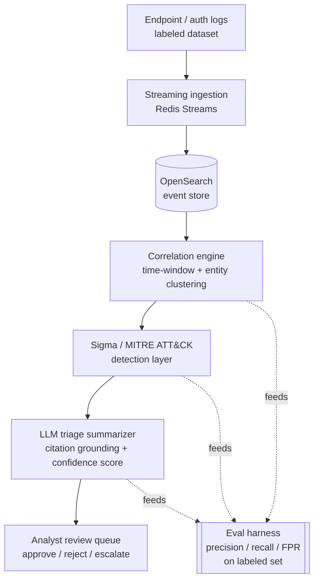

# sentinel-triage

**Cut mean-time-to-triage without teaching your SOC to cry wolf.**


## The real problem

SIEMs generate thousands of low-fidelity alerts a day. Tier-1 analysts spend
most of their shift manually correlating log lines across users, hosts, and
IPs just to figure out whether ten failed logins are an attack or someone
who forgot their password over a long weekend - and by the time they've
correlated it by hand, the fatigue has already set in and real incidents
start sliding past. Teams need automation that actually cuts
mean-time-to-triage, not another noisy layer that hallucinates false
positives and makes analysts trust the tooling even less.

`sentinel-triage` is a solo-buildable, trimmed-down slice of that problem:
one log source (endpoint/auth events), correlated into candidate incidents,
matched against Sigma rules mapped to MITRE ATT&CK, summarized by an LLM
that must cite the exact log lines it used, and dropped into a lightweight
analyst queue - with an eval harness that reports precision, recall, and
false-positive rate against a labeled dataset, so "it feels smart" is
replaced with a number.

## Architecture



| Stage | Module | What it does |
|---|---|---|
| Ingestion | `sentinel_triage.ingestion` | Loads the canonical event schema from CSV; buffers through a Redis-Streams-shaped interface; indexes into OpenSearch (or an in-memory fake for offline runs) |
| Correlation | `sentinel_triage.correlation.entity_clustering` | Groups events per entity (user) into candidate incidents via sliding time-window clustering |
| Detection | `sentinel_triage.detection.sigma_engine` | Evaluates a practical subset of Sigma rules (field selections + `count`/`distinct_count` aggregations over a rule-specific timeframe) against each incident, mapped to MITRE ATT&CK tactics/techniques |
| Triage | `sentinel_triage.triage` | Calls an LLM via function calling to summarize, cite specific `event_id`s, and assign confidence-scored severity; every citation is mechanically checked against the incident's real events (`validate_citation_grounding`) - a hallucinated id gets the assessment rejected, not silently trusted |
| Review | `sentinel_triage.review_queue` | SQLite-backed queue an analyst works: approve / reject / escalate, ordered by severity then confidence |
| Eval | `sentinel_triage.eval.harness` | Runs the whole pipeline over the labeled dataset and reports precision / recall / F1 / false-positive-rate, both overall and per attack type |

## Quick start

Requires Python 3.11+.

```bash
python -m venv .venv && source .venv/bin/activate
pip install -r requirements.txt
pip install -e .

# generate/refresh the bundled synthetic labeled dataset (deterministic, seeded)
python scripts/generate_dataset.py

# run the unit test suite (offline, no Docker/network/API key required)
python -m pytest -v

# run the eval harness against the labeled dataset
python scripts/run_eval.py

# run the full offline demo pipeline and print what an analyst would see
python scripts/ingest_and_triage.py
```

### Optional: real OpenSearch + Redis + Grafana stack

```bash
docker compose up -d
docker compose exec app python scripts/ingest_and_triage.py
```

This is entirely optional - every code path above works against in-memory
fakes and never touches Docker, a network socket, or a paid API. That's a
deliberate design choice (see "Offline-verifiable by design" below), not a
missing feature.

## How it works

**1. Ingestion.** `ingestion.loader` streams the canonical event schema
(`event_id`, `timestamp`, `host`, `user`, `src_ip`, `event_type`, `raw`,
`country`) out of a CSV. `ingestion.stream.InMemoryEventStream` buffers
events with the same add/read-cursor shape as a Redis Stream (`XADD`/
`XREAD`); `RedisEventStream` is the real adapter for production use.
`ingestion.opensearch_client.FakeOpenSearchIndexer` stores events in memory
with the same filter/range-query interface as the real `OpenSearchIndexer`.

**2. Correlation.** `correlation.entity_clustering.correlate_events`
partitions events by entity (username), then within each entity's
chronological timeline, starts a new candidate incident whenever the gap to
the previous event exceeds the correlation window (default 15 minutes).
This is single-linkage clustering along the time axis: a sustained 10-event
burst where consecutive events are a few minutes apart becomes one
incident even though the first and last event are 30+ minutes apart, which
matches how an analyst actually reads a session. Different users are never
merged just because their timestamps overlap.

**3. Detection.** `detection.sigma_engine` loads YAML rules from
`sigma_rules/` implementing a practical subset of Sigma: field-equality
`selections`, plus a `condition` combining `count(selection)` and
`distinct_count(selection.field)` aggregations against a rule-specific
`timeframe`. Rather than only checking the aggregate over the whole
(possibly wide) correlation-engine incident, it slides a window of the
rule's `timeframe` across the incident's matching events and finds the
sub-window that best satisfies the condition - so a brute-force rule with a
10-minute timeframe correctly fires on 6 failures 8 minutes apart inside a
45-minute incident, and correctly does NOT fire if those same 6 failures
are spread across the full 45 minutes. Four bundled rules:

| Rule | MITRE | Logic |
|---|---|---|
| Brute Force Authentication Attempts | T1110 / T1110.001 | >=5 `login_failure` in 10m |
| Impossible Travel Between Successful Logins | T1078 | `login_success` from >=2 distinct countries in 30m |
| Privilege Use Following Repeated Authentication Failures | T1078 / T1068 | >=3 `login_failure` and >=1 `privilege_use` in 15m |
| Account Lockout Following Failed Login Burst | T1110.001 | >=4 `login_failure` and >=1 `account_lockout` in 10m |

**4. Triage.** `triage.llm_client` defines a single OpenAI-tool-calling
function schema, `submit_triage_assessment(summary, severity, confidence,
cited_event_ids)`. `FakeLLMClient` is a deterministic, offline
implementation of that same contract (used by default, by the tests, and
by the eval harness) whose citations are built directly from the
detection engine's matched events, so it is structurally incapable of
citing an event outside the incident. `OpenAIFunctionCallingClient` is the
real backend; swap it in by passing an instance to `run_pipeline` /
`evaluate_dataset` instead of `FakeLLMClient()`. Either way,
`validate_citation_grounding` re-checks every citation against the real
incident after the call returns and raises `GroundingError` (dropping the
triage rather than trusting it) if every cited id is fabricated.

**5. Review queue.** `review_queue.queue.ReviewQueue` is a small SQLite
table. Triaged incidents land as `pending`, ordered by severity then
confidence; an analyst calls `approve` / `reject` / `escalate` exactly
once per incident (re-reviewing an already-decided incident raises
`InvalidTransitionError` rather than silently overwriting the audit
trail).

**6. Eval harness.** `eval.harness.evaluate_dataset` runs the whole
pipeline over a labeled CSV and scores it at the incident level (the
unit an analyst reviews): an incident is ground-truth positive if any of
its events was labeled malicious in the source data, and predicted
positive if triage assigned anything above `low` severity (equivalently:
at least one Sigma rule fired).

### Measured results (bundled synthetic dataset, 388 events / 296 incidents)

```
precision: 1.0000   recall: 0.8333   f1: 0.9091   false_positive_rate: 0.0000
per-attack-type recall: brute_force 1.00, privilege_escalation 1.00, impossible_travel 0.50
```

Reproduce with `python scripts/run_eval.py`. The honest gap: two of four
impossible-travel incidents are missed because the two logins in that
scenario can land more than the 15-minute correlation window apart, so the
correlation engine splits them into two single-country incidents before the
detection layer ever sees them together - a real limitation of windowed
correlation, not a detection-rule bug (see "Known limitations").

### Swapping in a real dataset

Any CSV with columns `event_id, timestamp, host, user, src_ip, event_type,
raw` (plus optional `country`, and for eval, `is_malicious`/`attack_type`)
works with `ingestion.load_events_from_csv` unchanged. This trimmed
prototype ships a synthetic dataset generated by
`scripts/generate_dataset.py` - modeled on the shape of public auth-log
corpora such as the LANL Comprehensive Multi-Source Cyber-Security Events
dataset - rather than redistributing a large public dataset directly, so
the repo stays small and the tests stay hermetic. Point `--dataset` at a
real one (after mapping its columns) to get real numbers.

## Known limitations

- **Correlation-window / rule-timeframe mismatch.** As above: if an
  attack's events span longer than the entity correlation window, the
  detection layer never gets to see them as one incident. A production
  version would correlate on a rolling basis across overlapping windows
  rather than a single greedy pass.
- **Single log source.** Only endpoint/auth events are modeled. Real SOC
  noise (network, DNS, EDR telemetry) is out of scope for this slice.
- **Sigma subset, not full Sigma.** No wildcard/regex field matching, no
  nested boolean parens, no `1 of selection*` syntax. Rules that need those
  would need translating.
- **FakeLLMClient is a stand-in.** It proves the grounding contract and
  gives deterministic, testable numbers; a real LLM will phrase summaries
  better but must still pass the same `validate_citation_grounding` check.

## Stretch goals (documented, not built)

- Multi-format ingestion (syslog, CEF, JSON) with format auto-detection,
  beyond the single CSV/auth-log format built here.
- Full pySigma backend integration for the complete Sigma condition
  grammar and community rule packs.
- Cross-entity correlation (e.g. lateral movement across multiple users
  sharing a source IP) instead of single-entity time-window clustering.
- A real Grafana dashboard definition (the `docker-compose.yml` starts
  Grafana, but no dashboard JSON is provisioned yet).

## Project layout

```
src/sentinel_triage/
  events.py                  canonical Event schema
  ingestion/                  CSV loader, Redis-Streams-shaped buffer, OpenSearch (+fake) indexer
  correlation/                 time-window + entity clustering
  detection/                  Sigma/MITRE rule engine
  triage/                      LLM function-calling client (fake + real) + citation grounding
  review_queue/                SQLite analyst queue
  eval/                        precision/recall/FPR harness
  pipeline.py                  wires it all together
sigma_rules/                  4 bundled detection rules (YAML)
data/                         bundled synthetic labeled dataset
scripts/                      generate_dataset.py, run_eval.py, ingest_and_triage.py
tests/                        pytest suite (unit + offline integration)
```

## Testing

```bash
python -m pytest -v                          # full offline suite
python -m pytest -v --cov=sentinel_triage      # with coverage
python -m pytest -m integration                # (none bundled runnable offline; documents the marker)
```

CI (`.github/workflows/ci.yml`) runs the dataset-generation determinism
check, the full test suite, the eval harness, and a Docker build on every
push/PR.

## Offline-verifiable by design

No secrets, no paid API calls, and no running Docker daemon or cluster are
required to build or test this project. `FakeOpenSearchIndexer`,
`InMemoryEventStream`, and `FakeLLMClient` implement the exact same
interfaces as their real counterparts (`OpenSearchIndexer`,
`RedisEventStream`, `OpenAIFunctionCallingClient`), which are lazily
imported and only touched if you explicitly construct them. The single
`@pytest.mark.integration`-marked test documents this boundary and is
excluded from the default `pytest` run via `pyproject.toml`'s `addopts`.

## License

MIT - see [LICENSE](LICENSE).

## Maintainer

Manmohan S. is a Supply Chain Analyst with over 4 years of experience in high-volume business environments, specializing in data analysis, operational reporting, and process improvement. He maintains this project to apply Python and SQL-based analytical frameworks to automated triage and data correlation challenges.

**Contact Information:**
- Email: manmohansangola1@gmail.com
- LinkedIn: https://www.linkedin.com/in/manmohan-sangola/